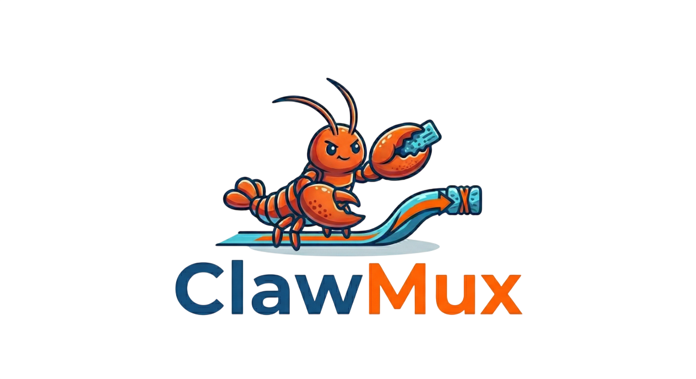

# ClawMux

Smart model routing + context compression proxy for OpenClaw.

## Features

- 🧠 **Smart Routing**: Embedding-based semantic classification → LIGHT/MEDIUM/HEAVY tier → automatic model selection
- 📦 **Context Compression**: Preemptive background summarization at configurable threshold (default 75%)
- 🔌 **All Providers**: Supports all OpenClaw providers via 6 API format adapters
- ⚡ **Zero Config Auth**: Uses OpenClaw's existing provider credentials — no separate API keys
- 📊 **Cost Tracking**: Real-time savings stats at /stats endpoint
- 🔄 **Hot Reload**: Config changes apply without restart

## Installation

Fetch the installation guide and follow it:

```bash
curl -s https://raw.githubusercontent.com/HyeokjaeLee/ClawMux/refs/heads/main/docs/guide/installation.md
```

## Configuration

Copy `clawmux.example.json` to `clawmux.json` and adjust as needed:

```jsonc
{
  "compression": {
    "threshold": 0.75,       // trigger compression at 75% of context window
    "model": "anthropic/claude-3-5-haiku-20241022",  // model used for summarization (provider/model format)
    "targetRatio": 0.6       // compress to 60% of original token count
  },
  "routing": {
    "models": {
      "LIGHT": "anthropic/claude-3-5-haiku-20241022",
      "MEDIUM": "anthropic/claude-sonnet-4-20250514",
      "HEAVY": "anthropic/claude-opus-4-20250514"
      // Model IDs use 'provider/model' format. Do NOT use "clawmux" as provider — causes infinite loops
    }
  },
  "server": {
    "port": 3456,
    "host": "127.0.0.1"
  }
}
```

Config is watched for changes. Edit `clawmux.json` while the proxy is running and it reloads automatically.

### Cross-Provider Routing

Mix models from different providers by tier. ClawMux automatically translates request and response formats between providers:

```jsonc
{
  "routing": {
    "models": {
      "LIGHT": "zai/glm-5",                          // ZAI (openai-completions)
      "MEDIUM": "anthropic/claude-sonnet-4-20250514",  // Anthropic (anthropic-messages)
      "HEAVY": "openai/gpt-5.4"                       // OpenAI (openai-completions)
    }
  }
}
```

All three providers must be configured in your `openclaw.json`. ClawMux handles format translation transparently — a request arriving in Anthropic format gets translated to OpenAI format when routed to GPT, and the response is translated back to Anthropic format before returning to OpenClaw.

Supported translation pairs: Anthropic ↔ OpenAI ↔ Google ↔ Ollama ↔ Bedrock (all combinations).

## Provider

ClawMux registers as a single provider `clawmux` in OpenClaw with model `auto`. It accepts all API formats (Anthropic, OpenAI, Google, Ollama, Bedrock) and translates between them automatically.

```bash
openclaw provider clawmux
```

## How It Works

```
OpenClaw → ClawMux Proxy (localhost:3456) → Upstream Provider(s)
              │
              ├── 1. Classify complexity (embedding model, ~4ms first run, <1ms cached)
              ├── 2. Select tier → LIGHT/MEDIUM/HEAVY
              ├── 3. Compress context if threshold exceeded
              ├── 4. Translate request format if cross-provider
              ├── 5. Forward to upstream with correct model
              └── 6. Translate response back to original format
```

**Routing tiers** map to model IDs you configure. A local embedding model (`Xenova/multilingual-e5-small`) classifies the semantic complexity of each request using nearest-centroid classification (~8ms p50), supporting both Korean and English. Short queries are detected by a lightweight heuristic and routed to LIGHT tier directly. No external API calls are needed for classification.

**Low confidence fallback**: When the classifier's confidence is low, the request is routed to MEDIUM tier. This prevents unreliable classifications from sending requests to an inappropriate tier — MEDIUM provides a safe cost/quality balance.

**Context compression** runs in the background after each response. When the conversation approaches the configured threshold, ClawMux summarizes older messages before the next request goes out. This keeps costs down on long conversations without interrupting the flow.

### Context Window Resolution

ClawMux resolves each model's context window using this priority chain:

1. **clawmux.json** `routing.contextWindows` — explicit per-model override
2. **openclaw.json** `models.providers[provider].models[].contextWindow` — user config
3. **OpenClaw built-in catalog** — pi-ai model database (812+ models)
4. **Default: 200,000 tokens**

Compression threshold uses the **minimum** context window across all routing models, since compression happens before routing decides which model to use.

## API Endpoints

| Method | Path | Description |
|---|---|---|
| `GET` | `/health` | Health check |
| `GET` | `/stats` | Cost savings statistics |
| `POST` | `/v1/messages` | Anthropic Messages |
| `POST` | `/v1/chat/completions` | OpenAI Chat Completions |
| `POST` | `/v1/responses` | OpenAI Responses |
| `POST` | `/v1beta/models/*` | Google Generative AI |
| `POST` | `/api/chat` | Ollama |
| `POST` | `/model/*/converse-stream` | Bedrock |

## Development

```bash
bun run dev          # start with watch mode
bun test             # run all tests
bun run typecheck    # type check without emit
```

Tests are co-located with source files as `*.test.ts`.

## Uninstall

```bash
clawmux uninstall
```

Stops the system service, removes the service file, and removes the `clawmux` provider from your OpenClaw config. A backup is created before any changes.
